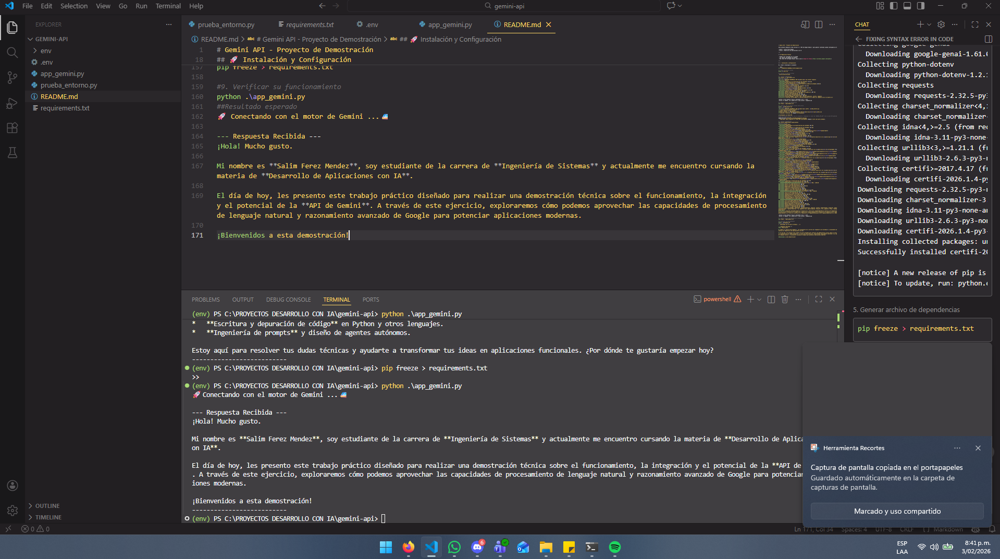

# Gemini API - Proyecto de Demostración

Este proyecto demuestra cómo utilizar la **API de Google Gemini** para
generar contenido usando inteligencia artificial.

**Autor:** Salim Ferez Mendez\
**Curso:** Desarrollo de Aplicaciones con IA

------------------------------------------------------------------------

## 📋 Requisitos Previos

-   Python 3.8+ instalado en tu sistema
-   pip (gestor de paquetes de Python)
-   Una clave API de Google Gemini (obtén una en [Google AI
    Studio](https://aistudio.google.com/apikey))

------------------------------------------------------------------------

## 🚀 Instalación y Configuración

### 1. Clonar o descargar el proyecto

``` bash
cd "c:\PROYECTOS DESARROLLO CON IA\gemini-api"
```

### 2. Crear un entorno virtual

``` bash
python -m venv env
```

### 3. Activar el entorno virtual

``` bash
.\env\Scripts\activate
```

### 4. Instalar dependencias

``` bash
pip install -r requirements.txt
```

### SALIDA ESPERADA

``` bash
(env) PS C:\PROYECTOS DESARROLLO CON IA\gemini-api> pip install requests
Collecting requests
  Downloading requests-2.32.5-py3-none-any.whl.metadata (4.9 kB)
Collecting charset_normalizer<4,>=2 (from requests)
  Downloading charset_normalizer-3.4.4-cp314-cp314-win_amd64.whl.metadata (38 kB)
Collecting idna<4,>=2.5 (from requests)
  Downloading idna-3.11-py3-none-any.whl.metadata (8.4 kB)
Collecting urllib3<3,>=1.21.1 (from requests)
  Downloading urllib3-2.6.3-py3-none-any.whl.metadata (6.9 kB)
Collecting certifi>=2017.4.17 (from requests)
  Downloading certifi-2026.1.4-py3-none-any.whl.metadata (2.5 kB)
Downloading requests-2.32.5-py3-none-any.whl (64 kB)
Downloading charset_normalizer-3.4.4-cp314-cp314-win_amd64.whl (107 kB)
Downloading idna-3.11-py3-none-any.whl (71 kB)
Downloading urllib3-2.6.3-py3-none-any.whl (131 kB)
Downloading certifi-2026.1.4-py3-none-any.whl (152 kB)
Installing collected packages: urllib3, idna, charset_normalizer, certifi, requests
Successfully installed certifi-2026.1.4 charset_normalizer-3.4.4 idna-3.11 requests-2.32.5 urllib3-2.6.3

[notice] A new release of pip is available: 25.2 -> 26.0
[notice] To update, run: python.exe -m pip install --upgrade pip
```

### 5. Generar archivo de dependencias

``` bash
pip freeze > requirements.txt
```

### 6. Verificar que el entorno virtual este activo

``` bash
python .\prueba_entorno.py
```

### Resultado esperado

``` bash
(env) PS C:\PROYECTOS DESARROLLO CON IA\gemini-api> python .\prueba_entorno.py
--- Verificación de Entorno Virtual ---
✅ Estado: Entorno Virtual ACTIVO.
📍 Ruta de Python: C:\PROYECTOS DESARROLLO CON IA\gemini-api\env\Scripts\python.exe
🌐 Conexión a internet: OK (Google es alcanzable).
```

🔐 Configurar la Clave API

Crear un archivo .env en la raiz el proyecto y reemplazar el valor de
"GEMINI_API_KEY" con la clave API generada, en este caso es la que se
encuentra en este zip

GEMINI_API_KEY=TU_CLAVE_DE_API

⚠️ Seguridad: Nunca compartas tu clave API públicamente.

### 7. Instalar dependencias

``` bash
pip install google-genai python-dotenv
```

### Salida esperada

``` bash
Collecting google-genai
  Downloading google_genai-1.61.0-py3-none-any.whl.metadata (53 kB)
Collecting python-dotenv
  Downloading python_dotenv-1.2.1-py3-none-any.whl.metadata (25 kB)
Collecting anyio<5.0.0,>=4.8.0 (from google-genai)
  Downloading anyio-4.12.1-py3-none-any.whl.metadata (4.3 kB)
Collecting google-auth<3.0.0,>=2.47.0 (from google-auth[requests]<3.0.0,>=2.47.0->google-genai)
  Downloading google_auth-2.48.0-py3-none-any.whl.metadata (6.2 kB)
Collecting httpx<1.0.0,>=0.28.1 (from google-genai)
  Downloading httpx-0.28.1-py3-none-any.whl.metadata (7.1 kB)
Collecting pydantic<3.0.0,>=2.9.0 (from google-genai)
  Downloading pydantic-2.12.5-py3-none-any.whl.metadata (90 kB)
Requirement already satisfied: requests<3.0.0,>=2.28.1 in c:\proyectos desarrollo con ia\gemini-api\env\lib\site-packages (from google-genai) (2.32.5)
Collecting tenacity<9.2.0,>=8.2.3 (from google-genai)
  Downloading tenacity-9.1.2-py3-none-any.whl.metadata (1.2 kB)
Collecting websockets<15.1.0,>=13.0.0 (from google-genai)
  Downloading websockets-15.0.1-py3-none-any.whl.metadata (6.8 kB)
Collecting typing-extensions<5.0.0,>=4.11.0 (from google-genai)
  Downloading typing_extensions-4.15.0-py3-none-any.whl.metadata (3.3 kB)
Collecting distro<2,>=1.7.0 (from google-genai)
  Downloading distro-1.9.0-py3-none-any.whl.metadata (6.8 kB)
Collecting sniffio (from google-genai)
  Downloading sniffio-1.3.1-py3-none-any.whl.metadata (3.9 kB)
Requirement already satisfied: idna>=2.8 in c:\proyectos desarrollo con ia\gemini-api\env\lib\site-packages (from anyio<5.0.0,>=4.8.0->google-genai) (3.11)
Collecting pyasn1-modules>=0.2.1 (from google-auth<3.0.0,>=2.47.0->google-auth[requests]<3.0.0,>=2.47.0->google-genai)
  Downloading pyasn1_modules-0.4.2-py3-none-any.whl.metadata (3.5 kB)
Collecting cryptography>=38.0.3 (from google-auth<3.0.0,>=2.47.0->google-auth[requests]<3.0.0,>=2.47.0->google-genai)
  Downloading cryptography-46.0.4-cp311-abi3-win_amd64.whl.metadata (5.7 kB)
Collecting rsa<5,>=3.1.4 (from google-auth<3.0.0,>=2.47.0->google-auth[requests]<3.0.0,>=2.47.0->google-genai)
  Downloading rsa-4.9.1-py3-none-any.whl.metadata (5.6 kB)
Requirement already satisfied: certifi in c:\proyectos desarrollo con ia\gemini-api\env\lib\site-packages (from httpx<1.0.0,>=0.28.1->google-genai) (2026.1.4)
Collecting httpcore==1.* (from httpx<1.0.0,>=0.28.1->google-genai)
  Downloading httpcore-1.0.9-py3-none-any.whl.metadata (21 kB)
Collecting h11>=0.16 (from httpcore==1.*->httpx<1.0.0,>=0.28.1->google-genai)
  Downloading h11-0.16.0-py3-none-any.whl.metadata (8.3 kB)
Collecting annotated-types>=0.6.0 (from pydantic<3.0.0,>=2.9.0->google-genai)
  Downloading annotated_types-0.7.0-py3-none-any.whl.metadata (15 kB)
Collecting pydantic-core==2.41.5 (from pydantic<3.0.0,>=2.9.0->google-genai)
  Downloading pydantic_core-2.41.5-cp314-cp314-win_amd64.whl.metadata (7.4 kB)
Collecting typing-inspection>=0.4.2 (from pydantic<3.0.0,>=2.9.0->google-genai)
  Downloading typing_inspection-0.4.2-py3-none-any.whl.metadata (2.6 kB)
Requirement already satisfied: charset_normalizer<4,>=2 in c:\proyectos desarrollo con ia\gemini-api\env\lib\site-packages (from requests<3.0.0,>=2.28.1->google-genai) (3.4.4)
Requirement already satisfied: urllib3<3,>=1.21.1 in c:\proyectos desarrollo con ia\gemini-api\env\lib\site-packages (from requests<3.0.0,>=2.28.1->google-genai) (2.6.3)
Collecting pyasn1>=0.1.3 (from rsa<5,>=3.1.4->google-auth<3.0.0,>=2.47.0->google-auth[requests]<3.0.0,>=2.47.0->google-genai)
  Downloading pyasn1-0.6.2-py3-none-any.whl.metadata (8.4 kB)
Collecting cffi>=2.0.0 (from cryptography>=38.0.3->google-auth<3.0.0,>=2.47.0->google-auth[requests]<3.0.0,>=2.47.0->google-genai)
  Downloading cffi-2.0.0-cp314-cp314-win_amd64.whl.metadata (2.6 kB)
Collecting pycparser (from cffi>=2.0.0->cryptography>=38.0.3->google-auth<3.0.0,>=2.47.0->google-auth[requests]<3.0.0,>=2.47.0->google-genai)
  Downloading pycparser-3.0-py3-none-any.whl.metadata (8.2 kB)
Downloading google_genai-1.61.0-py3-none-any.whl (721 kB)
   ━━━━━━━━━━━━━━━━━━━━━━━━━━━━━━━━━━━━━━━━ 721.9/721.9 kB 22.6 MB/s  0:00:00
Downloading anyio-4.12.1-py3-none-any.whl (113 kB)
Downloading distro-1.9.0-py3-none-any.whl (20 kB)
Downloading google_auth-2.48.0-py3-none-any.whl (236 kB)
Downloading httpx-0.28.1-py3-none-any.whl (73 kB)
Downloading httpcore-1.0.9-py3-none-any.whl (78 kB)
Downloading pydantic-2.12.5-py3-none-any.whl (463 kB)
Downloading pydantic_core-2.41.5-cp314-cp314-win_amd64.whl (2.0 MB)
   ━━━━━━━━━━━━━━━━━━━━━━━━━━━━━━━━━━━━━━━━ 2.0/2.0 MB 38.7 MB/s  0:00:00
Downloading rsa-4.9.1-py3-none-any.whl (34 kB)
Downloading tenacity-9.1.2-py3-none-any.whl (28 kB)
Downloading typing_extensions-4.15.0-py3-none-any.whl (44 kB)
Downloading websockets-15.0.1-py3-none-any.whl (169 kB)
Downloading python_dotenv-1.2.1-py3-none-any.whl (21 kB)
Downloading annotated_types-0.7.0-py3-none-any.whl (13 kB)
Downloading cryptography-46.0.4-cp311-abi3-win_amd64.whl (3.5 MB)
   ━━━━━━━━━━━━━━━━━━━━━━━━━━━━━━━━━━━━━━━━ 3.5/3.5 MB 41.5 MB/s  0:00:00
Downloading cffi-2.0.0-cp314-cp314-win_amd64.whl (185 kB)
Downloading h11-0.16.0-py3-none-any.whl (37 kB)
Downloading pyasn1-0.6.2-py3-none-any.whl (83 kB)
Downloading pyasn1_modules-0.4.2-py3-none-any.whl (181 kB)
Downloading typing_inspection-0.4.2-py3-none-any.whl (14 kB)
Downloading pycparser-3.0-py3-none-any.whl (48 kB)
Downloading sniffio-1.3.1-py3-none-any.whl (10 kB)
Installing collected packages: websockets, typing-extensions, tenacity, sniffio, python-dotenv, pycparser, pyasn1, h11, distro, anyio, annotated-types, typing-inspection, rsa, pydantic-core, pyasn1-modules, httpcore, cffi, pydantic, httpx, cryptography, google-auth, google-genai
Successfully installed annotated-types-0.7.0 anyio-4.12.1 cffi-2.0.0 cryptography-46.0.4 distro-1.9.0 google-auth-2.48.0 google-genai-1.61.0 h11-0.16.0 httpcore-1.0.9 httpx-0.28.1 pyasn1-0.6.2 pyasn1-modules-0.4.2 pycparser-3.0 pydantic-2.12.5 pydantic-core-2.41.5 python-dotenv-1.2.1 rsa-4.9.1 sniffio-1.3.1 tenacity-9.1.2 typing-extensions-4.15.0 typing-inspection-0.4.2 websockets-15.0.1

[notice] A new release of pip is available: 25.2 -> 26.0
[notice] To update, run: python.exe -m pip install --upgrade pip
```

### 8. Generar archivo de dependencias nuevamente

``` bash
pip freeze > requirements.txt
```

### 9. Verificar su funcionamiento

``` bash
python .\app_gemini.py
```

### Resultado esperado

🚀 Conectando con el motor de Gemini ...🚈

--- Respuesta Recibida ---

¡Hola! Mucho gusto.

Mi nombre es **Salim Ferez Mendez**, soy estudiante de la carrera de
**Ingeniería de Sistemas** y actualmente me encuentro cursando la
materia de **Desarrollo de Aplicaciones con IA**.

El día de hoy, les presento este trabajo práctico diseñado para realizar
una demostración técnica sobre el funcionamiento, la integración y el
potencial de la **API de Gemini**. A través de este ejercicio,
exploraremos cómo podemos aprovechar las capacidades de procesamiento de
lenguaje natural y razonamiento avanzado de Google para potenciar
aplicaciones modernas.

¡Bienvenidos a esta demostración!

## IMAGEN DEL FUNCIONAMIENTO DEL TRABAJO


